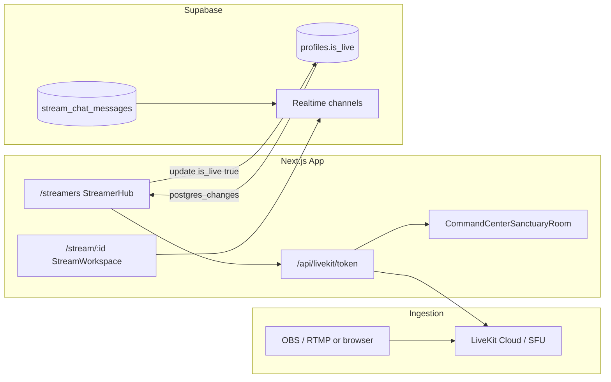

# Kick-Inspired Streamers Home — Architecture, Flows & GitHub Ops

This document maps a **Kick-style 3-column discovery hub** to the **live PARABLE implementation**. It is the canonical reference for layout, data flow, open-source building blocks, and CI scripts in this repository.

> **Production surface:** [`/streamers`](/streamers) → `src/app/streamers/page.tsx` (`StreamerHub`)  
> **Watch room:** [`/stream/[streamId]`](/stream/[streamId]) → LiveKit player + `StreamWorkspace` chat  
> **Creator ops:** [`/dashboard/streamers`](/dashboard/streamers) → schedule, Stripe Connect, amen counter

---

## 1. Open-source blueprint (what to use, not reinvent)

| Layer | Upstream repo | PARABLE usage |
|-------|----------------|---------------|
| **Ultra-low latency video** | [livekit/livekit](https://github.com/livekit/livekit) | `@livekit/components-react`, `livekit-server-sdk`, `/api/livekit/token` |
| **Realtime presence & chat transport** | [supabase/supabase](https://github.com/supabase/supabase) | `@supabase/supabase-js`, Postgres changes + Broadcast channels |
| **UI primitives** | [shadcn-ui/ui](https://github.com/shadcn-ui/ui) | Lucide icons, Tailwind patterns (custom PARABLE theme) |
| **E2E verification** | [microsoft/playwright](https://github.com/microsoft/playwright) | `tests/streamers-hub.spec.ts` |

There is **no single GitHub gist** that ships a full Kick clone with ministry tooling, LiveKit go-live, Stripe, and sermon AI. PARABLE composes the rows above.

---

## 2. Layout design & structure (3-column discovery hub)

### Gamer mode (`viewMode === 'gamer'`)

Kick palette: `#0B0E11` (canvas), `#191F24` (panels), `#242F37` (borders), emerald CTAs.

```
┌─────────────────────────────────────────────────────────────────────────────┐
│ Header (global nav) + PARABLE LIVE bar + [Switch to Clean Mode]              │
├──────────────┬──────────────────────────────────────────┬───────────────────┤
│ LEFT 240px   │ CENTER (flex-1, scroll)                  │ RIGHT 300px       │
│ Recommended  │ • Live spotlight carousel                │ Global activity   │
│ channels     │ • Live rolodex chips                     │ rail              │
│ (follows +   │ • AI Sanctuary CTA                       │ Broadcast modes   │
│  creator hub)│ • Category grid (6-col)                  │ Creator shortcuts │
│              │ • #channel-grid (StreamersLiveGrid)      │                   │
├──────────────┴──────────────────────────────────────────┴───────────────────┤
│ TOP (full width, above 3-col): Go-live hero, LiveKit embed, director dock   │
│ Live channel pill rail (mock liveRail + Discover more)                      │
└─────────────────────────────────────────────────────────────────────────────┘
```

### Clean mode (`viewMode === 'clean'`)

- Restores `HubBackground`, cyan PARABLE theme, **larger category cards** (`grid-cols-1 sm:2 md:3`).
- Hides left/right sidebars on `md+`; stacks creator hub, spotlight, broadcast controls in the center column.
- Same hooks and handlers — **only JSX wrappers and Tailwind change**.

### File map

| UI region | Component / file |
|-----------|------------------|
| Page shell + toggle | `src/app/streamers/page.tsx` |
| Left follows rail | `src/components/streamers/StreamersFollowSidebar.tsx` |
| Center grid | `src/components/streamers/StreamersLiveGrid.tsx` |
| Rolodex | `src/components/streamers/LiveRolodexBrowse.tsx` |
| Right activity | `src/components/streamers/StreamersActivityRail.tsx` |
| Watch + chat + gifts | `src/components/StreamWorkspace.tsx`, `StreamWorkspaceClient.tsx` |
| Live video player (viewer) | `src/components/LiveVideoPlayer.tsx` — token from `GET /api/livekit/get-token?room=&identity=` or `POST /api/livekit/viewer-token` |
| Amen / reactions | `src/lib/stream-interactions.ts`, `GiftOverlayCanvas.tsx` |

---

## 3. Platform architecture & data flow

### End-to-end live path



### Stream status (`profiles.is_live`)

1. Creator clicks **Start stream** on `/streamers` → `openStudioLive()`.
2. Client POSTs `/api/livekit/token` with Supabase JWT.
3. On success, `profiles.is_live = true` for `user.id`.
4. `StreamersFollowSidebar` subscribes to `postgres_changes` on `profiles` and refreshes LIVE rings.
5. **End stream** / disconnect → `is_live = false`.

Relevant code: `src/app/streamers/page.tsx` (`openStudioLive`, `toggleLive`), `src/lib/studio-session.ts`.

### Discovery grid (home feed)

- **Mock tiles today:** `STREAMS` / `filteredTiles` in `page.tsx` for demo channels.
- **Live directory (optional DB):** query `profiles` where `is_live = true`, order by `viewer_count` — requires columns from `supabase/schema-stream-live-discovery.sql`.
- **Follows rail:** real data via `follows` → `profiles` join in `StreamersFollowSidebar`.

### Chat routing (per-stream isolation)

| Mechanism | Channel / table | Event |
|-----------|-----------------|--------|
| Persistent chat (SQL) | `stream_chat_messages.stream_id` | INSERT → Realtime `postgres_changes` |
| Ephemeral reactions | `realtime-stream-interactions:{streamId}` | Broadcast `amen_reaction` |
| UI | `StreamWorkspace` | Local state + optional Supabase subscription |

Constants: `streamInteractionChannelName()`, `AMEN_REACTION_EVENT` in `src/lib/stream-interactions.ts`.

Apply chat schema: `supabase/schema-stream-chat.sql` (see §5).

---

## 4. Process flows (manual + automated)

### A. Creator go-live

1. Open `/streamers` → **Start stream**.
2. LiveKit room mounts in-page (`sanctuaryLiveKit` state).
3. Optional: **Director mode** → teleprompter overlay, AI Architect link.
4. Profile shows on-air badge; followers see LIVE ring in left rail.

### B. Viewer discovery → watch

1. `/streamers` → category card, rolodex chip, or `#channel-grid` link.
2. Navigate to `/watch/[id]` or `/stream/[id]`.
3. `StreamWorkspace` loads player slot + chat + gifts (gamer/clean toggle on watch page).

### C. Dashboard / monetization

1. `/dashboard/streamers` — broadcast schedule (`/api/broadcast/schedule`), Stripe Connect onboard.
2. Amen counter uses realtime broadcast channel (see streamers-hub E2E).

### D. GitHub CI (automated)

| Workflow | Trigger | What it runs |
|----------|---------|----------------|
| [`.github/workflows/deploy.yml`](../.github/workflows/deploy.yml) | `push` / `PR` → `main` | `npm run lint`, `npm run build`, full Playwright, Vercel deploy |
| [`.github/workflows/streamers-hub.yml`](../.github/workflows/streamers-hub.yml) | `push` / `PR` (path filter) | Build + **only** `tests/streamers-hub.spec.ts` |

**Local commands:**

```bash
npm run dev:turbo          # http://localhost:3003
npm run test:e2e:streamers # streamers hub spec only
npm run build              # production compile check
```

**Required GitHub secrets (CI):** `NEXT_PUBLIC_SUPABASE_URL`, `NEXT_PUBLIC_SUPABASE_ANON_KEY`, optional `SUPABASE_SERVICE_ROLE_KEY` for schedule API tests.

---

## 5. Supabase SQL scripts (apply in Dashboard → SQL)

| Script | Purpose |
|--------|---------|
| [`supabase/profiles-add-is-live.sql`](../supabase/profiles-add-is-live.sql) | Core `is_live` flag (already used) |
| [`supabase/schema-stream-live-discovery.sql`](../supabase/schema-stream-live-discovery.sql) | `current_category`, `viewer_count`, live directory index |
| [`supabase/schema-stream-chat.sql`](../supabase/schema-stream-chat.sql) | Per-stream chat log + RLS + Realtime |

After applying chat schema, enable **Replication** for `stream_chat_messages` in Supabase Dashboard.

Live chat on `/streamers` is implemented via `useStreamChat` + `StreamersHubLiveChat` (Realtime on `stream_chat_messages`). Same pattern can be reused in `StreamWorkspace` if needed.

---

## 6. Environment variables (live-ready checklist)

| Variable | Role |
|----------|------|
| `NEXT_PUBLIC_SUPABASE_URL` | Client + server Supabase |
| `NEXT_PUBLIC_SUPABASE_ANON_KEY` | Auth + RLS queries |
| `SUPABASE_SERVICE_ROLE_KEY` | Schedule API / admin (CI optional) |
| `LIVEKIT_API_KEY` / `LIVEKIT_API_SECRET` / `LIVEKIT_URL` | Vercel server env — token minting (`get-token`, `token`, `viewer-token`) |
| `NEXT_PUBLIC_LIVEKIT_URL` | Vercel client env — same `wss://` host as `LIVEKIT_URL` for `LiveVideoPlayer` |
| `NEXT_PUBLIC_PARABLE_DEV_GUEST` | Local E2E guest bypass (`1` in CI) |

---

## 7. Reference stub vs production page

The Kick tutorial stub (`KickStreamerHome` with mock `useEffect`) is **not** checked into this repo as the production route. It illustrates layout only.

**Production** = `StreamerHub` in `src/app/streamers/page.tsx` with:

- `useAuth`, `createClient`, LiveKit, modals, `resolveStreamersNavHref`, mock + real rails, `viewMode` gamer/clean.

When porting external Kick examples, **change JSX/Tailwind wrappers only** — do not replace state machines or API routes.

---

## 8. Test matrix (`tests/streamers-hub.spec.ts`)

| Area | Coverage |
|------|----------|
| Discovery | Hero, search, `#channel-grid`, trending tab |
| Navigation | Categories → `/gaming`, grid → `/watch`, rolodex |
| Creator tools | Teleprompter, sermon checker, tools drawer |
| Broadcast | Mode pills, schedule API (when service role set) |
| Realtime | Amen reaction (LiveKit path, may skip in guest CI) |

---

## 9. LiveKit webhook (OBS ingress → `profiles.is_live`)

**Endpoint:** `POST /api/livekit/webhook` (`src/app/api/livekit/webhook/route.ts`)

1. Apply `supabase/schema-livekit-ingress.sql` — adds `profiles.livekit_ingress_stream_key`.
2. In **LiveKit Cloud → Settings → Webhooks**, set URL to `https://<your-domain>/api/livekit/webhook`.
3. Store each creator’s Ingress **stream key** on their profile (`livekit_ingress_stream_key`).
4. Events handled:
   - `ingress_started` / `ingress_ended` — match `streamKey` → toggle `is_live`
   - `room_started` / `room_finished` — match room `parable-live-{userId}` (browser go-live)

Uses `WebhookReceiver` with raw body + `Authorization` header (do not parse JSON before verify).

## 10. Implementation backlog (production hardening)

- [ ] Replace mock `STREAMS` grid with `profiles.is_live` query + Realtime reorder.
- [ ] Persist chat via `stream_chat_messages` instead of local-only arrays.
- [ ] Creator UI to copy OBS stream key into `livekit_ingress_stream_key`.
- [ ] Global hub chat panel → subscribe to `stream_id = 'global'` or activity rail API.

For questions or schema apply order, see [`docs/SUPABASE_SETUP.md`](./SUPABASE_SETUP.md).
